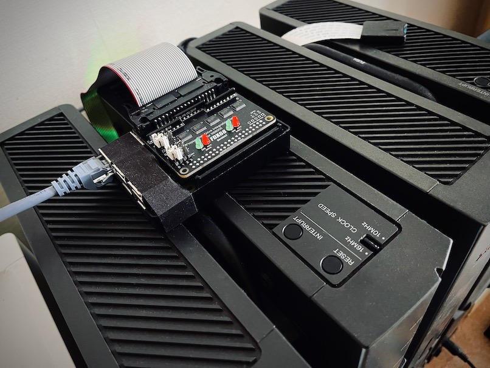
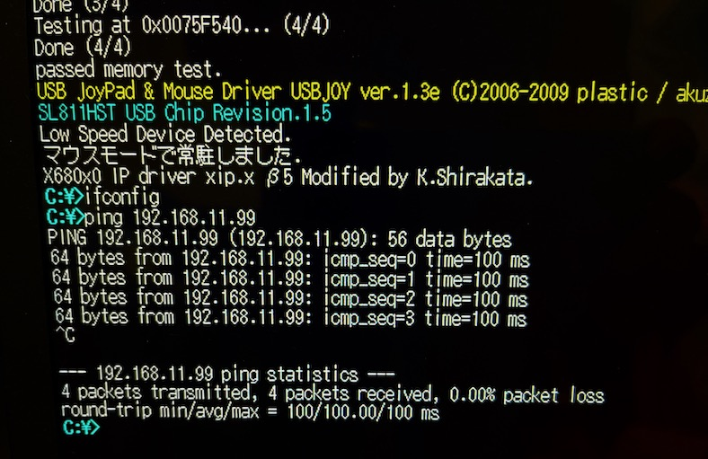
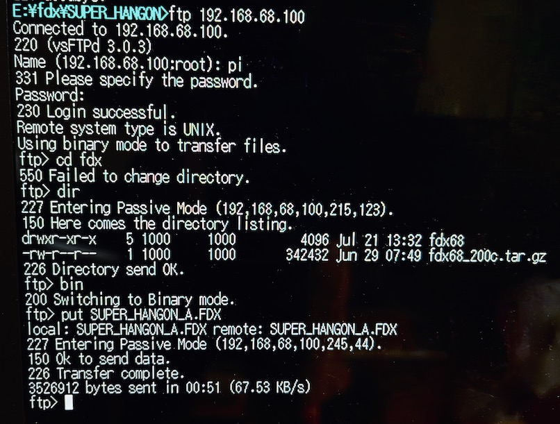

# X680x0実機 + Nereid と Raspberry Pi をイーサネットで直結するための覚書

## はじめに

この覚書は X680x0用 USB/LAN/Memory対応 同人ハードウェア Nereid の Ethernet 接続機能を利用して、Raspberry Pi とクロスケーブルで直結してファイルのやり取りを行うための覚書です。

この覚書は以下の実機にて確認した結果ですが、内容の正確性を何ら保証するものではありません。

* X68000XVI(16.7MHz) メモリ本体2MB + 内部増設6MB の合計8MB
* Nereid + midiori 複合ボード
* 市販のイーサネットクロスケーブル1m [https://www.amazon.co.jp/dp/B0037CSLRC](https://www.amazon.co.jp/dp/B0037CSLRC)
* Raspberry Pi 3B+ (FDX68シールド付)

最終的には FDX68 のファイル管理と制御をHuman68k側から行えるようにすることを目指しています。

---

## ハードウェアの準備

* X680x0実機
* Nereid (設計：X-PowerStation)
* イーサネットクロスケーブル
* Raspberry Pi 3B+ または 4B

---

## 今回のIPネットワーク構成

|Host|Hostname|IP|Subnet Mask|
-|-|-|-
|X68000XVI Nereid|xvi|192.168.68.99|255.255.255.0|
|Raspberry Pi|raspi|192.168.68.100|255.255.255.0|

2ホスト間のpeer-to-peer通信のみ考える。

---

## ソフトウェアの準備 (X680x0)

以下を導入する。すべてかまださんのX68000 LIBRARYから入手できます。

* Human68k 3.02 及び関連ソフトウェア

[http://retropc.net/x68000/software/sharp/human302/](http://retropc.net/x68000/software/sharp/human302/)

* Nereid添付ディスク

[http://retropc.net/x68000/software/hardware/nereid/disk/](http://retropc.net/x68000/software/hardware/nereid/disk/)

* etherL12.sys

Nereid添付ディスク内のether_ne.sysと差し替えて使います。1.7倍高速とのことです。

[http://retropc.net/x68000/software/hardware/neptune_x/etherL12/](http://retropc.net/x68000/software/hardware/neptune_x/etherL12/)

* ftp.x (NetBSDからの移植版)

Nereid添付ディスク内のftp.xと差し替えて使います。Nereid添付ディスク内のftp.xではvsftpdとの通信が確立できません。

[http://retropc.net/x68000/software/internet/ftp/ftp/](http://retropc.net/x68000/software/internet/ftp/ftp/)

---

## ソフトウェアの構成 (X680x0)

### CONFIG.SYS

Nereidの推奨設定に従うが、ether_ne.sys の代わりに etherL12.sys を使う。

        FILES     = 50
        BUFFERS   = 99 4096
        LASTDRIVE = Z:
        PROCESS   = 16 10 50
        DEVICE    = \USR\SYS\etherL12.sys

### AUTOEXEC.BAT
        xip -n2
        ifconfig lp0 up
        ifconfig en0 192.168.68.100 netmask 255.255.255.0 up
        
### \usr\etc\hosts
        127.0.0.1       localhost   localhost
        192.168.68.99   xvi
        192.168.68.100  raspi

### \usr\etc\network
        127   loopback
        192.168.68  private-net

### \usr\etc\protocols
        ip    0     IP
        icmp  1     ICMP
        tcp   6     TCP
        udp   17    UDP

### \usr\etc\services
        ftp-data  20/tcp
        ftp       21/tcp
        telnet    23/tcp
        domain    53/tcp    nameserver
        domain    53/udp    nameserver
        finger    79/tcp    finger

---

## ソフトウェアの準備 (Raspberry Pi)

* 32bit Lite の最新版

* vsftpd ftpサーバー

        sudo apt-get install vsftpd

* ftp クライアント (動作確認用)

        sudo apt-get install ftp

---

## ソフトウェアの構成 (Raspberry Pi)

### /etc/dhcpcd.conf

        # Example static IP configuration:
        interface eth0
        static ip_address=192.168.68.100/24

### /etc/vsftpd.conf

        listen=YES
        listen_ipv6=NO
        write_enable=YES

---

## 動作確認

### Raspberry Pi -> X680x0 ping

        ping 192.168.68.99

### Raspberry Pi ftp loopback

        ftp 192.168.68.100

### X680x0 -> Raspberry Pi ping

        ping 192.168.68.100

### X680x0 -> Raspberry Pi ftp

        ftp 192.168.68.100

